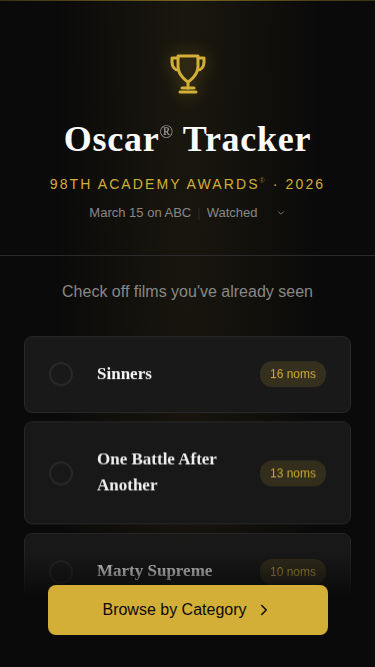
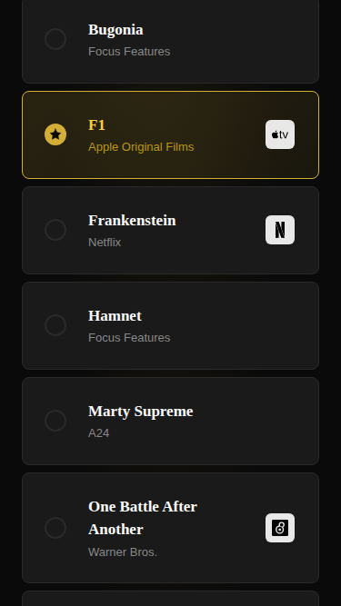
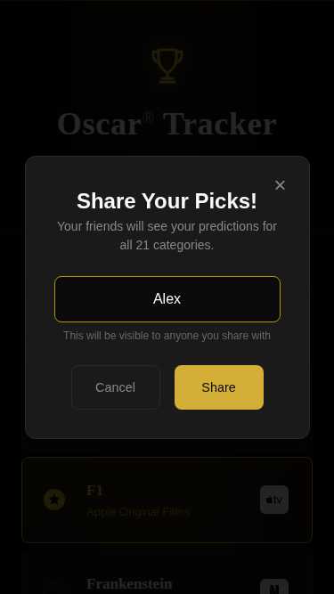
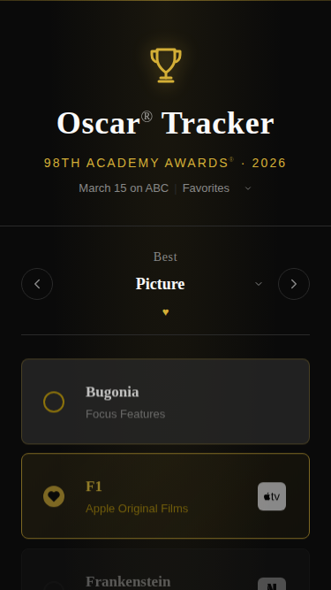
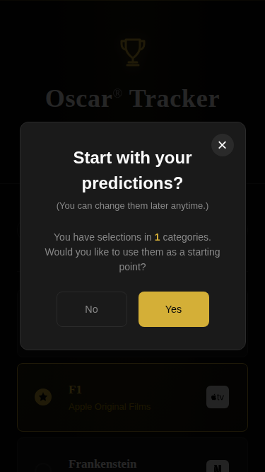
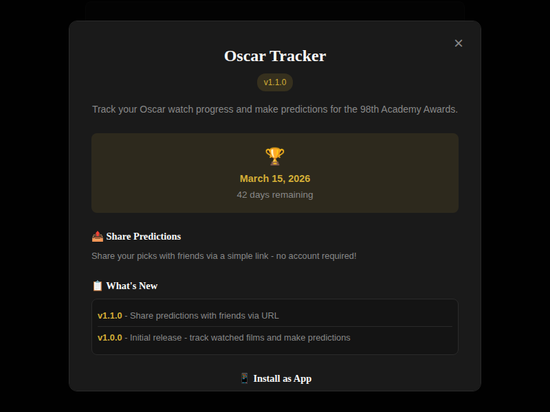

# Oscar Tracker

A progressive web app for tracking Oscar-nominated films, making predictions, and sharing picks with friends.

<p align="center">
  
  
  
</p>

## Features

### Track Your Watch Progress
- Check off films as you watch them across all 21 Oscar categories
- See nomination counts for each film
- Progress indicator shows how many you've seen

### Make Predictions
- Pick your winners for each category
- Single-select mode ensures one prediction per category
- Track your prediction progress separately from watched films

### Pick Your Favorites
- Choose your personal favorites (what *should* win)
- Import from your predictions with one tap
- Heart icons distinguish favorites from predictions

### Share with Friends
- Share your predictions via URL - no account needed
- View friends' picks side-by-side with yours
- Works great for Oscar party competitions

### Beautiful Design
- Elegant gold and black awards-show aesthetic
- Streaming service icons (Netflix, Max, Apple TV+, etc.)
- Responsive design works on mobile, tablet, and desktop
- Sticky "Browse by Category" button during onboarding

<p align="center">
  
  
  
</p>

## Installation

### As a PWA (Recommended)

**iOS Safari:**
1. Open the site in Safari
2. Tap the Share button
3. Select "Add to Home Screen"

**Android Chrome:**
1. Open the site in Chrome
2. Tap the menu (three dots)
3. Select "Add to Home screen" or "Install app"

**Desktop:**
1. Open the site in Chrome/Edge
2. Click the install icon in the address bar
3. Or use the browser menu to install

### For Development

Serve the files with any static server:

```bash
# Using Python
python3 -m http.server 3000

# Using Node
npx serve

# Using PHP
php -S localhost:3000
```

## Testing

This project uses Playwright for E2E testing:

```bash
# Run all tests
npx playwright test

# Run with visible browser
npx playwright test --headed

# Run specific test file
npx playwright test tests/predictions.spec.js
```

## Deploying to GitHub Pages

1. Create a new repository on GitHub
2. Push this code to the repository
3. Go to Settings > Pages
4. Set source to "Deploy from a branch" and select `main` / `root`
5. Your site will be available at `https://username.github.io/repo-name`

The deploy workflow automatically versions each build.

## File Structure

```
oscar-tracker/
├── index.html          # Main HTML with PWA meta tags
├── style.css           # Styles with CSS variables
├── app.js              # App logic and localStorage
├── sw.js               # Service worker for offline
├── manifest.json       # Web app manifest
├── icons/              # App and streaming service icons
├── splash/             # iOS splash screens
├── tests/              # Playwright E2E tests
└── docs/               # Documentation and screenshots
```

## Privacy

All data is stored locally on your device using localStorage. Nothing is ever sent to a server. When you share predictions, the data is encoded in the URL itself.

## Tech Stack

- Vanilla HTML/CSS/JavaScript (no build step)
- Service Worker for offline caching
- localStorage for data persistence
- CSS custom properties for theming
- Google Fonts (Playfair Display + Libre Franklin)
- Playwright for testing

## License

MIT
